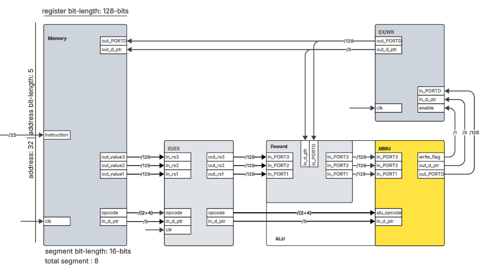

# Pipelined SIMD multimedia unit Design with VHDL/Verilog

## Prokect Description
This project focuses on the structural and behavioral design of a four-stage pipelined Multimedia Unit (MMU). The design is implemented using VHDL, a hardware description language, to model the MMU with a reduced subset of multimedia instructions, similar to those in Sony Cell SPU and Intel SSE architectures. 

The complete 4-stage pipelines is designed at the register transfer level (RTL) developed in a structural manner with several modules operating simultaneously. Each stage of the pipeline is defined by a module that is developed behaviorally with inter-stage register. Verification of each module will be done individually with their respective self-checking test benches. This will ensure the functional correctness of all stages of the pipeline prior to full system integration of the 4-stage MMU.  

The complete top-level MMU model is then instantiated with another test bench to validate the completeness of the four-stage pipeline, where each instruction will cycle through all stages of the pipeline. The resulting outputs will demonstrate the operational behavior and status of each pipeline stage during execution. 

> **Note:** Diagram showing 3 out of 4 stages(Memory, ALU, Forwarding) of the complete pipeline, emphsizing the MMU stage of the ALU compoment.
## Overview
This paper presents **Part I of the Final Report**, focusing exclusively on the architecture of the Multimedia ALU during the execution stage. 
At this phase, no prior knowledge of the complete pipeline design is required for implementing the Multimedia ALU module. The MMU is assumed to received all the correct and necessary input signals from the previous module up to the stage following the forwarding unit.

A behavioral model approach is employed to design the test bench for the MMU during execution. The expected results for each test case are predetermined to facilitate the self-checking aspect of the test bench design. A direct comparison between the MMU's outputs and the expected result ensure accurate functional verification of the instruction sets.
